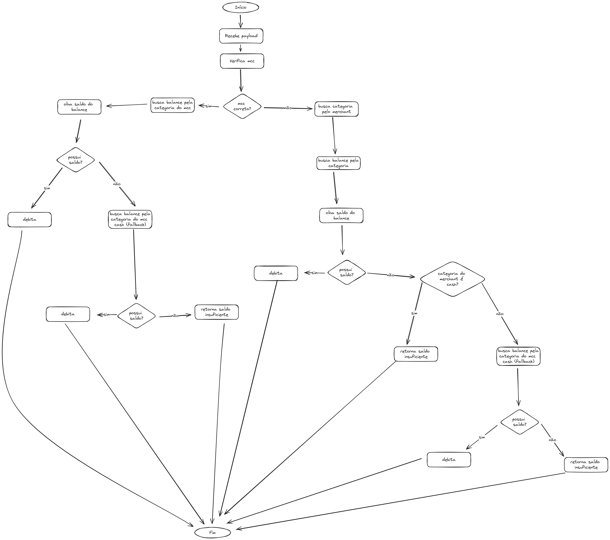

# Teste backend empresa Caju

Foi escolhido a linguagem Golang por conta de afinidade e simplicidade, tentei ao máximo não usar bibliotecas externas para demonstrar minhas hardskills.

## Stack

| Linguagem      | Versão |
| ---------      | -------|
| Golang         | 1.22   |
| Docker         | 27.0.3 |
| Docker compose | v2.28.1 |

## L1, L2, L3

Implementados via lógica dentro do código.

## L4

Pergunta aberta sobre transações simultâneas foi resolvida por meio de transactions do mysql, partindo da abordagem *pessimistic looking*.

### Comandos

#### Subir a api

```
docker compose up app --build
```

##### *Porta default é 8080*

#### Rodar testes

```
docker compose run test
```

### Diagrama



#### Implementações extras

- Foi adicionado um workflow de ci no github actions que:
  - Realiza lint do código (golint)
  - Roda os testes ao publicar mudanças na branch
